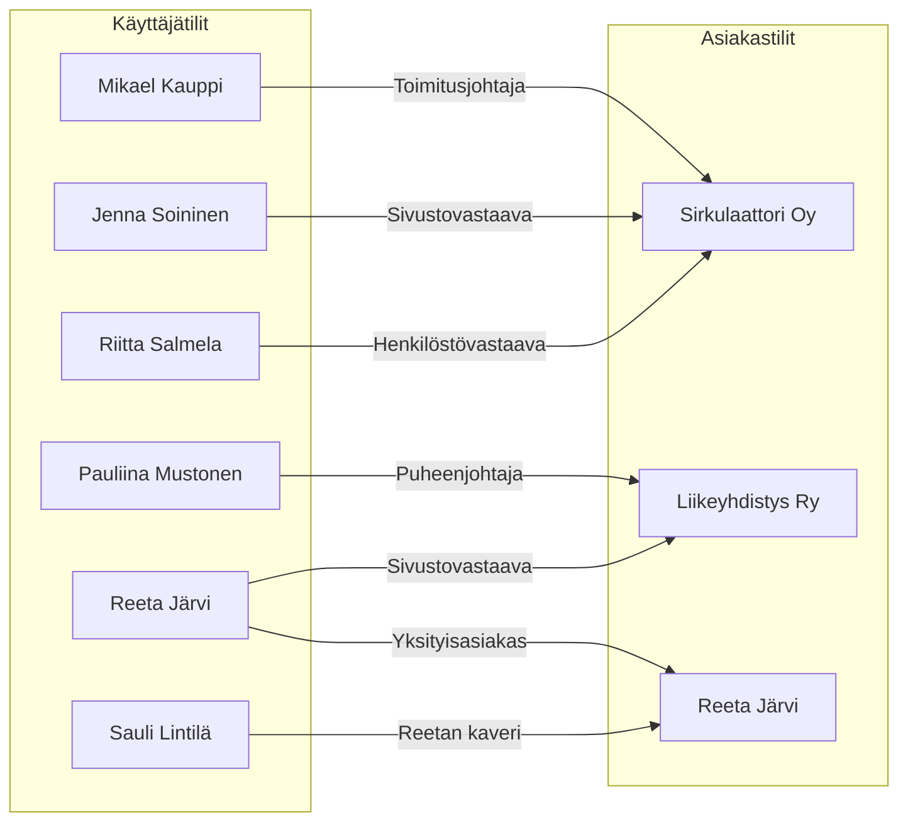

import Image from "@theme/IdealImage";

# Asiakasalue

Asiakasalueella käytössä on erikseen käyttäjä- ja asiakastilejä. Käyttäjätilit
ovat henkilökohtaisia tilejä, joida hallitaan asiakkuuksia. Tämä mahdollistaa
sen, että voit hallita yhden tai useamman yrityksen, yhteisön, tai henkilön
asiakkuutta.

Esimerkissä näet, kuinka eri käyttäjätileille on jaettu hallinta- ja/tai
katseluoikeuksia eri asiakastileille.

## Käyttäjä- ja asiakastili

Asiakasalueella on erikseen käyttäjä- ja asiakastilejä. Käyttäjätili on
yksilöllinen ja se on luotu sinulle. Asiakastili on yrityksesi oma ja se on
luotu yrityksesi Y-tunnuksen tai asiakasnimen perusteella. Asiakastiliä
käytetään mm. palveluiden tilaamiseen ja laskujen maksamiseen.

Yhdellä käyttäjätilillä voi olla useampi asiakastili. Voit vaihtaa asiakastiliä
seuraavasti:

1. Kirjaudu käyttäjätilillesi osoitteessa
   [bittivirta.cloud/login](https://bittivirta.cloud/login)
2. Valitse "Vaihda asiakastili"
    <Image style={{maxWidth: 600}} img={require("./assets/asiakastili.png")} />
3. Valitse asiakastili, jolle haluat kirjautua klikkaamalla "Vaihda asiakastili"
    <Image img={require("./assets/asiakastilit.png")} />
