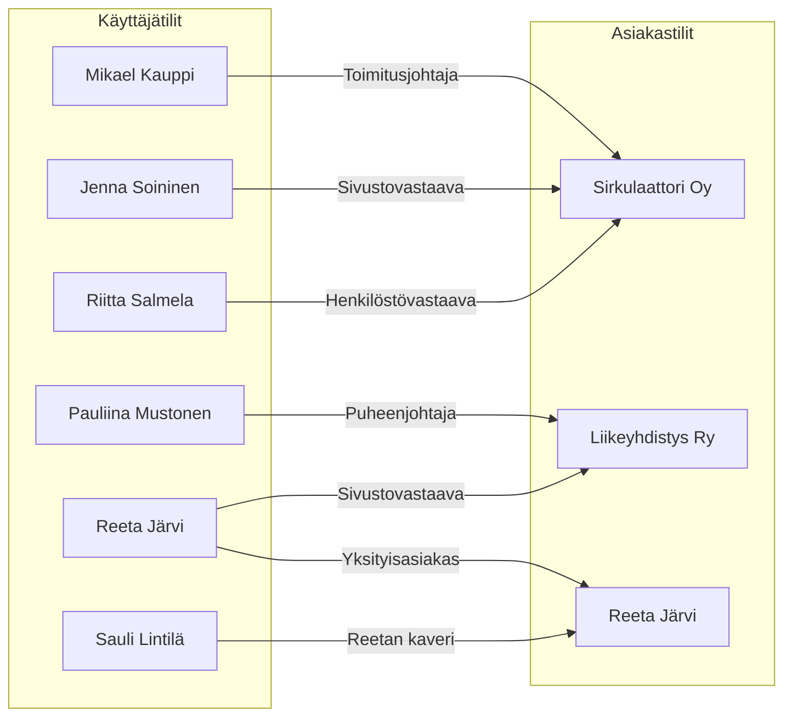

---
authors:
  - korhox
---

# Tilit

Asiakasalueella käytössä on erikseen käyttäjä- ja asiakastilejä. Käyttäjätilit
ovat henkilökohtaisia tilejä, joida hallitaan asiakkuuksia. Tämä mahdollistaa
sen, että voit hallita yhden tai useamman yrityksen, yhteisön, tai henkilön
asiakkuutta.

Esimerkissä näet, kuinka eri käyttäjätileille on jaettu hallinta- ja/tai
katseluoikeuksia eri asiakastileille.

