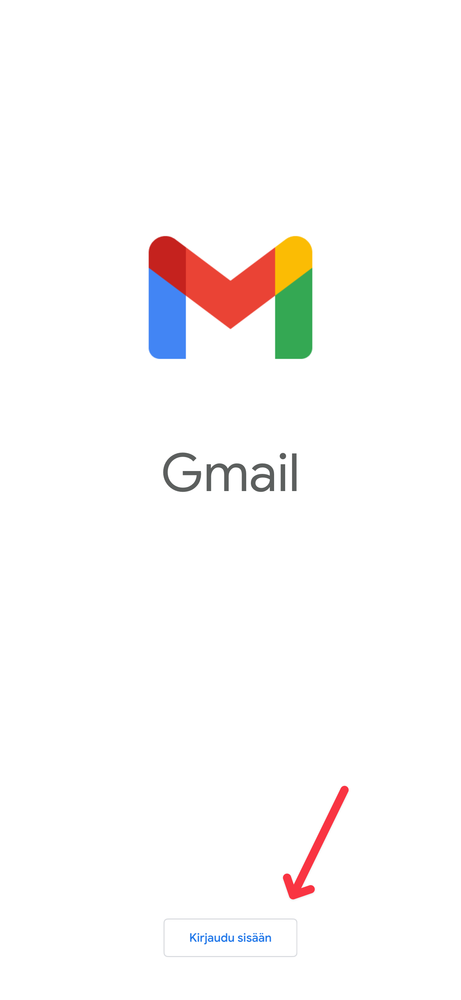
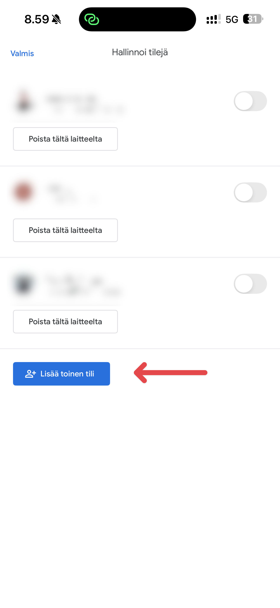
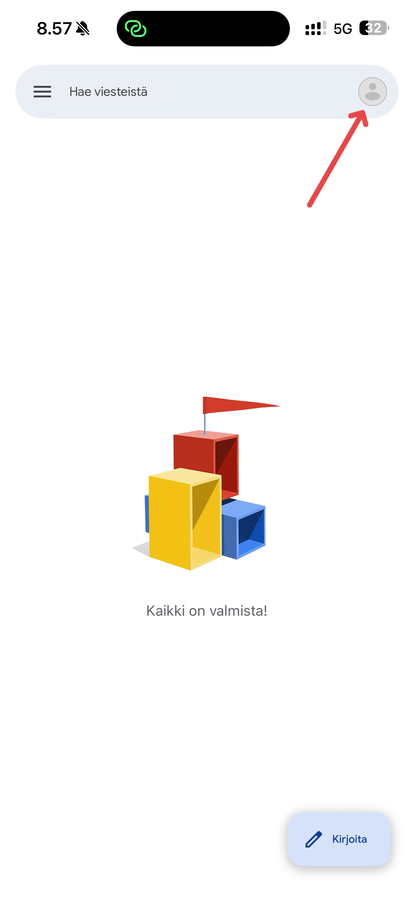
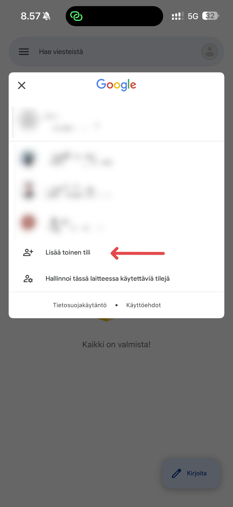
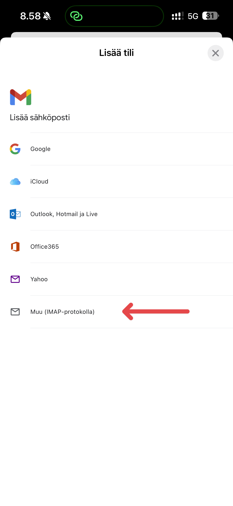
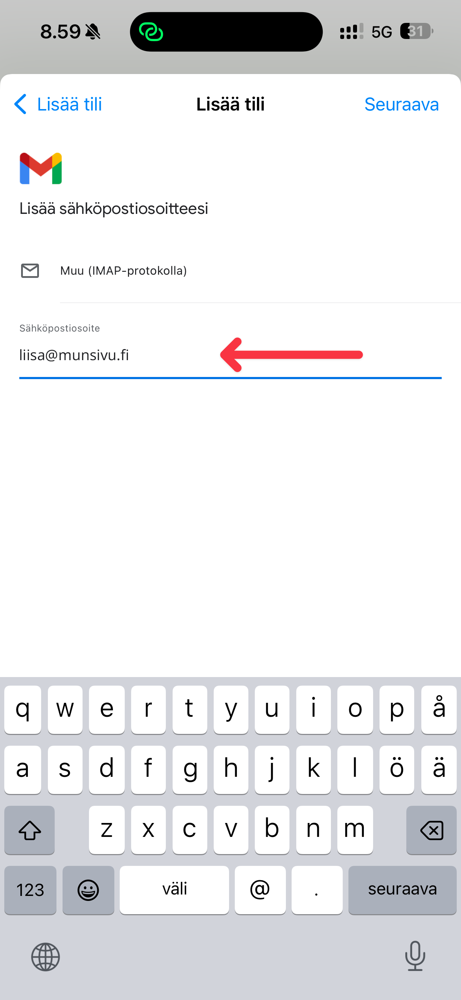
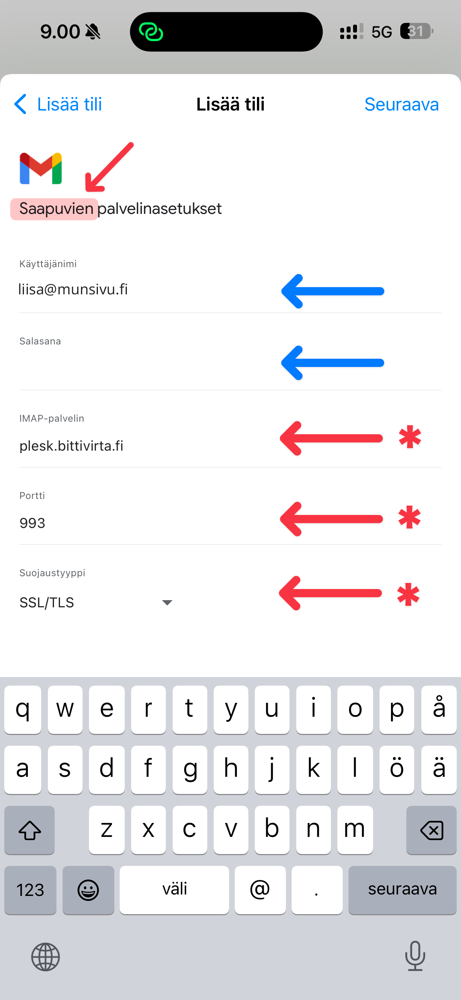
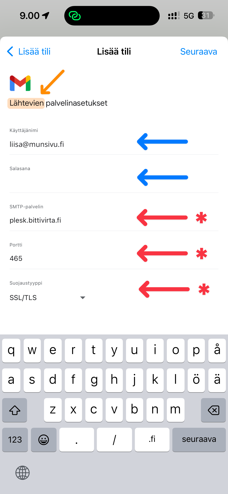
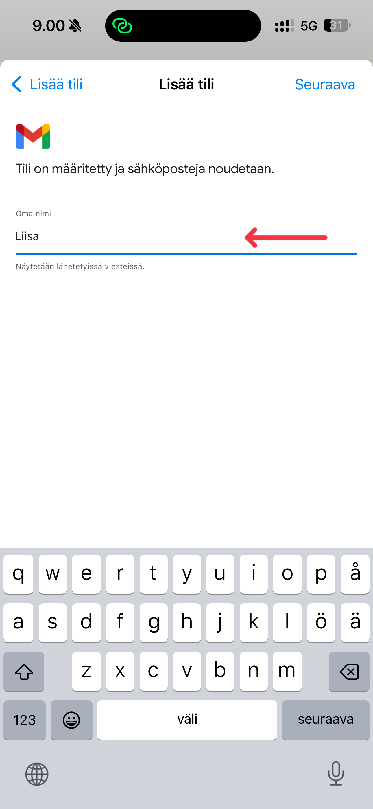
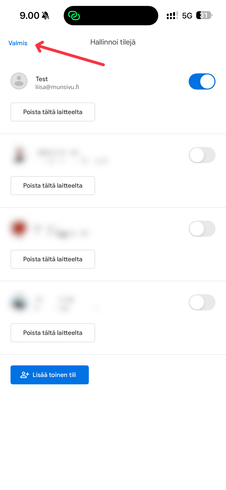

# Gmailiin kirjautuminen

Kuvaohjeet Gmail-sovelluksella kirjautumiseen.

Lataa Gmail-sovellus:
- [Apple iOS](https://apps.apple.com/fi/app/gmail-email-by-google/id422689480)
- [Android](https://play.google.com/store/apps/details?id=com.google.android.gm&hl=fi-FI)

<Stepper>
  <Step>

    <Icon icon="info-circle" className="text-cloud-600" /> Jos käytät jo Gmail-sovellusta, siirry seuraavaan vaiheeseen.

    

    <Icon icon="info-circle" className="text-cloud-600" /> Jos et ole kirjautuneena muissa Googlen sovelluksissa, et välttämättä näe tätä vaihetta.

    
  </Step>
  <Step>
    <Icon icon="info-circle" className="text-cloud-600" /> Jos sinulla ei ollut Gmail-sovellusta, et näe tätä vaihetta ja voit siirtyä seuraavaan vaiheeseen.

    Klikkaa profiilikuvaasi hakupalkissa:
    

    Klikkaa "Lisää toinen tili":
    
  </Step>
  <Step>
    Valitse "Muu (IMAP-protokolla)":
    
  </Step>
  <Step>
    Anna sähköpostiosoite:
    
  </Step>
  <Step>
    Täytä saapuvien sähköpostien asetukset. Tähdellä merkityt kentät ovat aina samoja käyttäjästä riippumatta.

    Käyttäjänimi on sähköpostiosoitteesi ja salasana on salasana, jonka määritit tilille. Salasana ei ole sama, kuin Pleskissä tai asiakasalueella.

    Portti on **993**.

    
  </Step>
  <Step>
    Täytä lähtevien sähköpostien asetukset. Tähdellä merkityt kentät ovat aina samoja käyttäjästä riippumatta.

    Käyttäjänimi on sähköpostiosoitteesi ja salasana on salasana, jonka määritit tilille. Salasana ei ole sama, kuin Pleskissä tai asiakasalueella.

    Toisin sanoen, asetukset ovat samat, vain portti on eri.

    Portti on **465**.

    
  </Step>
  <Step>
    Anna tilille nimi, joka näkyy Gmailin käyttöliittymässä.
    
  </Step>
  <Step>
    Klikkaa "Valmis", tai lisää vielä toinen kohta ja toista vaiheet alkaen kohdasta 3.
  </Step>
  <Step>
    Sähköpostisi on nyt lisätty Gmailiin. Voit lähettää ja vastaanottaa sähköposteja sovelluksen kautta.
    
  </Step>
</Stepper>
