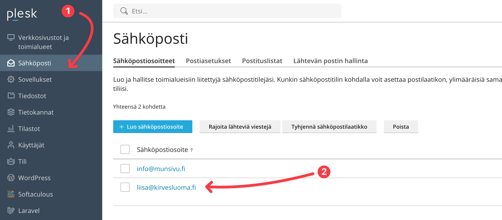
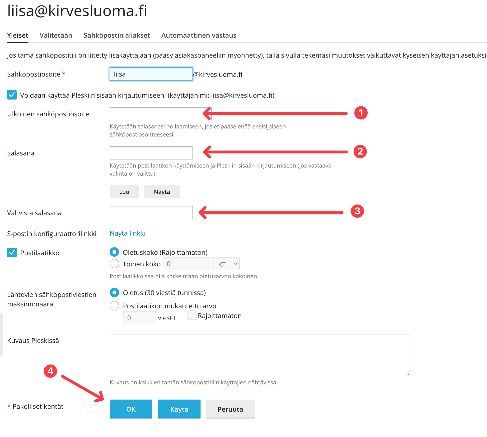

# Sähköpostin salasanan nollaaminen

Jos olet unohtanut salasanasi, voit nollata sen joko toissijaista sähköpostia käyttämällä tai Plesk-hallintapaneelin kautta. Tässä ohjeet molempiin tapoihin.

## Toissijaisesta sähköpostista

Tämä on yleisin salasanan nollausmenetelmä, kun käytössä on toissijainen sähköposti tai sinulla ei ole webhotellin pääkäyttäjän tunnuksia esimerkiksi työntekijänä.

<Stepper>
  <Step>
    Avaa Plesk-hallintapaneelin kirjautumissivu osoitteessa [https://plesk.bittivirta.fi](https://plesk.bittivirta.fi).
  </Step>
  <Step>
    Klikkaa "Unohtuiko salasana?" -linkkiä kirjautumissivulla.
  </Step>
  <Step>
    Syötä sähköpostiosoitteesi, jonka salasanan unohdit. Älä käytä toissijaista sähköpostia, vaan itse tilin sähköpostiosoitetta, jonka salasanan unohdit.

    Salasanan nollausviesti lähetetään sähköpostiin, joka on liitetty kyseiseen sähköpostitiliin. Jos et saa sähköpostia, tarkista myös roskapostikansiosi. Mikäli tämäkään ei auta, pyydä webhotellin pääkäyttäjää nollaamaan salasanasi Plesk-hallintapaneelin kautta.

    Jos sinulla on pääkäyttäjän tunnukset, voit nollata salasanasi Plesk-hallintapaneelin kautta alla olevan ohjeen mukaan.
  </Step>
  <Step>
    Noudata sähköpostissa annettuja ohjeita ja luo uusi salasana. Varmista, että uusi salasana on vahva.
  </Step>
</Stepper>

## Plesk-hallintapaneelin kautta

Jos sinulla on pääkäyttäjän tunnukset, voit nollata salasanasi Plesk-hallintapaneelin kautta. Tämä on hyödyllistä, jos et pääse kirjautumaan toissijaisen sähköpostin kautta.

<Stepper>
  <Step>
    Kirjaudu Plesk-hallintapaneeliin näiden ohjeiden mukaan: [Hallintapaneeliin kirjautuminen](../panel-login).
  </Step>
  <Step>
    Siirry "Sähköposti" -osioon hallintapaneelissa ja valitse sähköpostitili, jonka salasanan haluat nollata klikkaamalla sähköpostiosoitetta.
    
  </Step>
  <Step>
    1. **Ulkoinen sähköpostiosoite:** Tämän sähköpostiosoitteen avulla tilin salasana voidaan nollata ilman pääkäyttäjän tunnuksia, salasanan nollauslinkki lähetetään tähän osoitteeseen, kun sitä pyydetään.
    2. **Salasana:** Salasana, jonka haluat asettaa tälle sähköpostitilille. Varmista, että uusi salasana on vahva.
    3. **Vahvista salasana:** Toista uusi salasana varmistaaksesi.
    4. **Tallenna:** Tallenna tekemäsi muutokset.

    Lisävinkit:
    1. Luo salasana salasanan luontitoiminnolla, joka luo satunnaisen vahvan salasanan.
    2. Luo salasanan vaihtolinkki, jonka voit antaa esimerkiksi työntekijälle, jolloin hän voi itse nollata salasanansa. Linkki on kertakäyttöinen.

    
  </Step>
  <Step>
    Klikkaa "Change Password" -painiketta ja syötä uusi salasana.
  </Step>
</Stepper>
