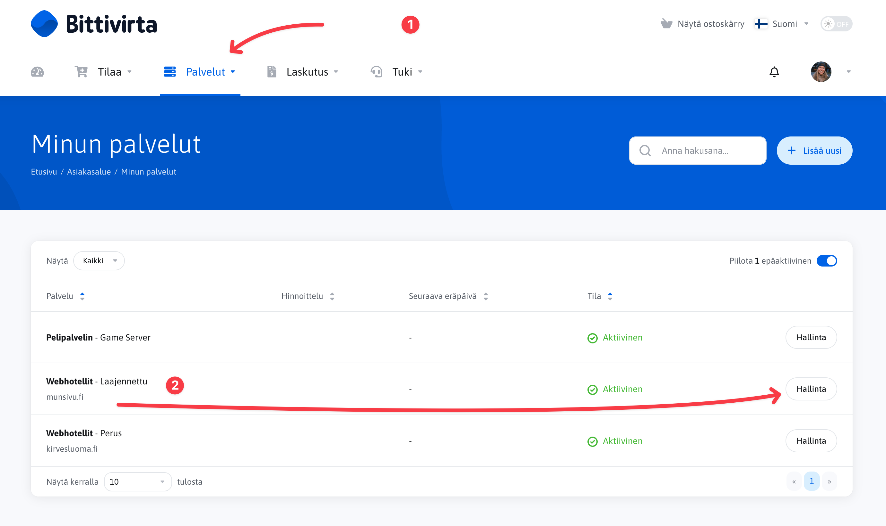
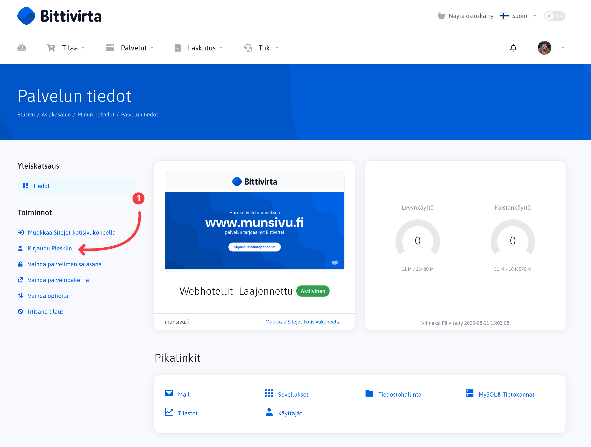
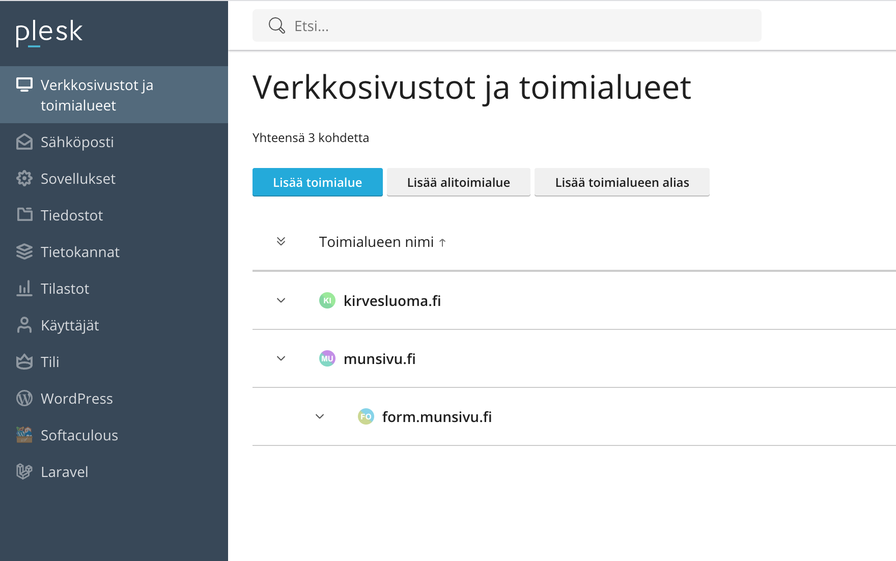

# Hallintapaneeliin kirjautuminen

Webhotellin hallinta tapahtuu Plesk-hallintapaneelin kautta. Voit kirjautua hallintapaneeliin joko asiakasalueen (Portaalin) kautta, suoraan [hallintapaneeliin](https://plesk.bittivirta.fi), webhotellin tunnuksilla. Huomaa, että hallintapaneelin tunnukset ovat erilliset asiakasalueen tunnuksista.

## Portaalin kautta kirjautuminen

<Stepper>
  <Step>
    Avaa bittivirran asiakasalue, Portaali osoitteessa [https://portal.bittivirta.fi](https://portal.bittivirta.fi).
  </Step>
  <Step>
    Kirjaudu sisään asiakasalueen tunnuksillasi, jotka loit tai sinulle luotiin tilauksen yhteydessä. Jos olet unohtanut tai et tiedä salasanaasi, voit palauttaa sen [täällä](https://portal.bittivirta.fi/password/reset).
  </Step>
  <Step>
    Siirry "Palvelut"-sivulle ja valitse haluamasi webhotellin kohdalla "Hallitse"
        
  </Step>
  <Step>
    Klikkaa "Kirjaudu Pleskiin" -painiketta.
        
  </Step>
  <Step>
    Nyt näet Plesk-hallintapaneelin, jossa voit hallita webhotelliasi, kuten verkkosivustoja, sähköpostitilejä ja muita asetuksia.
        
</Step>
</Stepper>

## Suora kirjautuminen hallintapaneeliin

Voit myös kirjautua suoraan Plesk-hallintapaneeliin käyttämällä webhotellin tunnuksia. Tämä on hyödyllistä, jos haluat ohittaa asiakasalueen.

1. Avaa Plesk-hallintapaneeli osoitteessa [https://plesk.bittivirta.fi](https://plesk.bittivirta.fi).
2. Kirjaudu sisään webhotellin tunnuksillasi.

Jos et muista salasanaasi, voit nollata sen asiakasalueen kautta. Katso ohjeet salasanan nollaamiseen [täältä](./reset-password.mdx).
