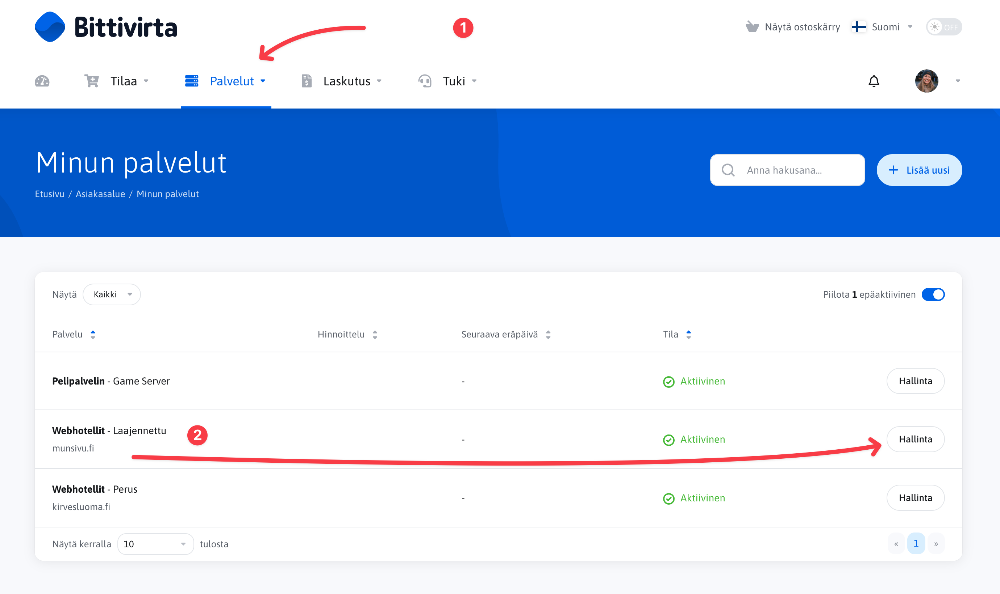
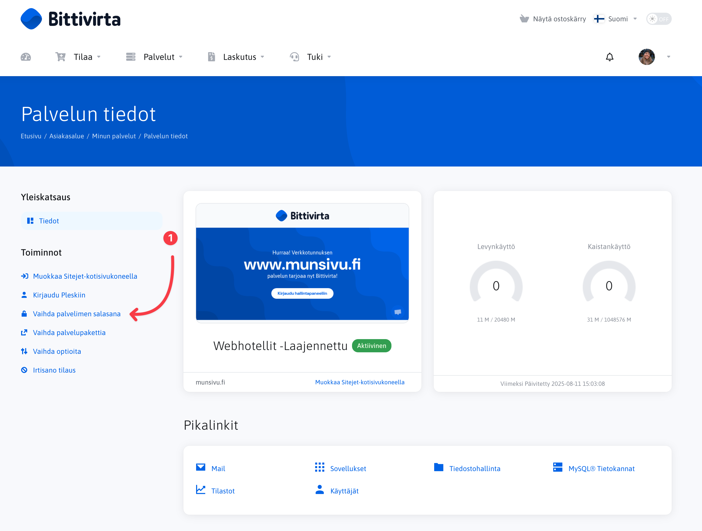
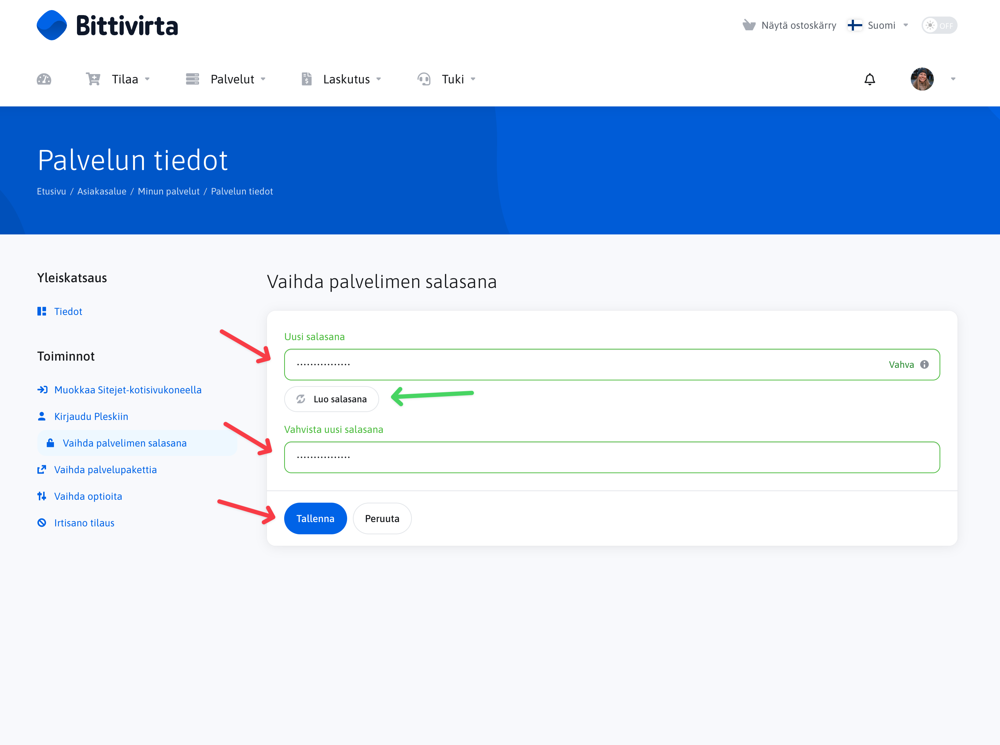
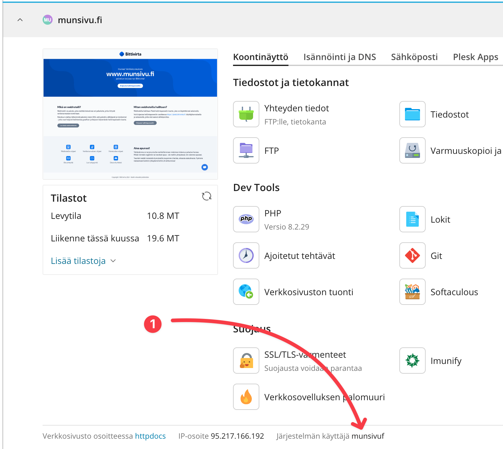

# Salasanan nollaaminen

## Sähköpostitilin salasanan nollaaminen

Jos sinun tarvitsee nollata sähköpostitilin salasana, voit tehdä sen tämän ohjeen mukaan: [Sähköpostitilin salasanan nollaaminen](./email/reset-password).

## Webhotellin pääkäyttäjän salasanan nollaaminen

Jos et pääse Plesk-hallintapaneeliin virheellisen salasanan vuoksi, voit nollata salasanasi seuraavasti:

<Stepper>
  <Step>
    Avaa bittivirran asiakasalue, Portaali osoitteessa [https://portal.bittivirta.fi](https://portal.bittivirta.fi).
  </Step>
  <Step>
    Kirjaudu sisään asiakasalueen tunnuksillasi, jotka loit tai sinulle luotiin tilauksen yhteydessä. Jos olet unohtanut tai et tiedä salasanaasi, voit palauttaa sen [täällä](https://portal.bittivirta.fi/password/reset).
  </Step>
  <Step>
    Siirry "Palvelut"-sivulle ja valitse haluamasi webhotellin kohdalla "Hallitse"
    
  </Step>
  <Step>
    Klikkaa "Vaihda palvelimen salasana" -linkkiä sivun vasemmassa reunassa.
    
  </Step>
  <Step>
    Syötä uusi salasana ja vahvista se. Varmista, että uusi salasana on vahva. Muista, että tämän salasanan avulla pääsee kirjautumaan webhotellisi pääkäyttäjänä, joten valitse salasana huolellisesti.

    Pääkäyttäjä voi tehdä muutoksia kaikkiin webhotellisi asetuksiin.

    Vinkki: Voit myös luoda salasanan "Luo salasana"-toiminnolla. Suosittelemme käyttämään vähintään 16 merkin pituista salasanaa, joka sisältää isoja ja pieniä kirjaimia, numeroita sekä erikoismerkkejä.

    Tallenna uusi salasana painamalla "Tallenna" -painiketta.

    
  </Step>
  <Step>
    Nyt olet nollannut salasanasi. Voit kirjautua Plesk-hallintapaneeliin uudella salasanallasi osoitteessa [https://plesk.bittivirta.fi](https://plesk.bittivirta.fi).

    Plesk-käyttäjätunnuksen olet saanut sähköpostitse tilauksen yhteydessä. Jos et muista käyttäjätunnustasi, voit tarkistaa sen kirjautumalla Pleskiin asiakasalueen kautta ja avaamalla sen toimialueen tiedot, jonka käyttäjänimen haluat tarkistaa:
    
  </Step>
</Stepper>
