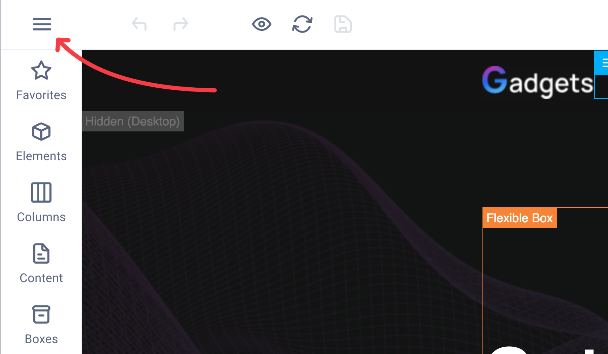
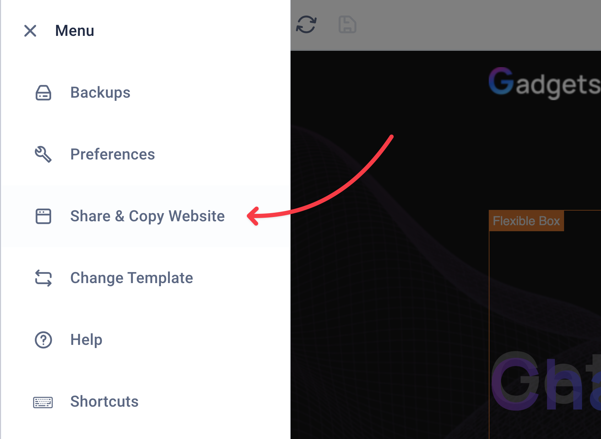
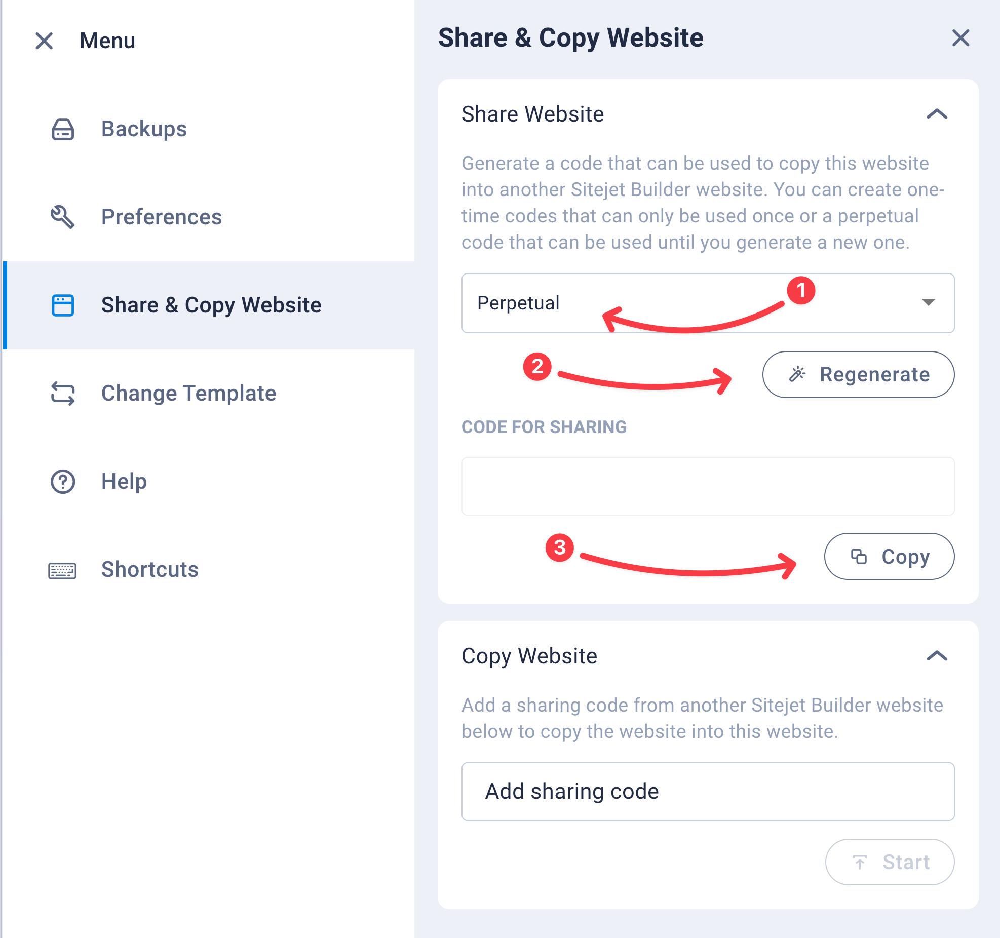
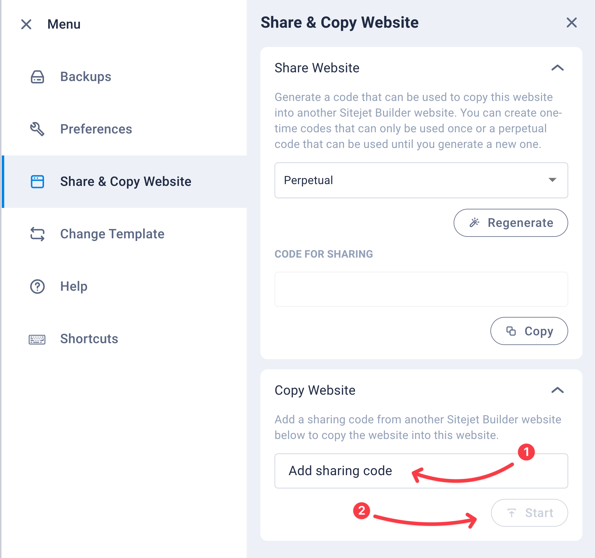

# Sivuston siirto toiselta palveluntarjoajalta

SiteJet-sivuston voi siirtää toiselta palveluntarjoajalta Bittivirran webhotelliin, tai Bittivirran webhotellista toiselle palveluntarjoajalle. Sivuston siirto onnistuu helposti SiteJet-sivustonmuokkaimessa.

Tässä ohjeessa käymme läpi vain SiteJet-sivuston siirron.

## Sivuston siirto Bittivirran webhotelliin

Ennen vanhan sivuston tilauksen päättämistä, tee siirto uuteen webhotelliin. Sivuston siirto onnistuu seuraavasti:
<Stepper>
  <Step>
    Kirjaudu vanhan palveluntarjoajan hallintapaneeliin ja avaa SiteJet-sivustomuokkain.

    SiteJet-sivustorakentaja saattaa olla nimetty eri tavalla, mutta tunnistat SiteJet-sivustomuokkaimen siitä, että sen URL-osoite alkaa `cms.sitehub.io`.
  </Step>
  <Step>
    Avaa SiteJetin valikko vasemmasta yläkulmasta, kolmen vaakaviivan kuvakkeesta.
    
  </Step>
  <Step>
    Klikkaa "Share & Copy Website" -painiketta.
    
  </Step>
  <Step>
    Valitse "Perpetual" tai "One-Time" -siirto, riippuen siitä, kumman haluat. Tämän jälkeen kopioi siirtokoodi leikepöydälle tekstikentästä tai klikkaa "Copy" -painiketta.
    - **Perpetual**: Koodilla voi kopioida sivuston useamman kerran, niin kauan kunnes luot uuden koodin.
    - **One-Time**: Koodilla voi kopioida sivuston vain kerran
    
  </Step>
  <Step>
    Kirjaudu sisään Bittivirran Plesk-hallintapaneeliin joko asiakasalueen kautta tai suoraan osoitteessa [https://plesk.bittivirta.fi/](https://plesk.bittivirta.fi/). Ohjeet kirjautumiseen löydät [täältä](../panel-login).
  </Step>
  <Step>
    Valitse sivusto ja avaa SiteJet-sivustomuokkain sivuston "Aloita"-välikehdeltä. Jos et ole vielä valinnut teemaa, valitse teemaksi "Blank", joka löytyy kategoriasta "Blank".

    Valitulla teemalla ei ole väliä, koska siirrät sivuston vanhasta palveluntarjoajasta.
  </Step>
  <Step>
    Avaa SiteJetin valikko vasemmasta yläkulmasta, kolmen vaakaviivan kuvakkeesta.
    
  </Step>
  <Step>
    Klikkaa "Share & Copy Website" -painiketta.
    
  </Step>
  <Step>
    Liitä aiemmin kopioitu siirtokoodi tekstikenttään "Add sharing code" ja klikkaa "Start".
    
  </Step>
  <Step>
    Sivustosi siirto on valmis! Voit nyt muokata sivustoasi SiteJet-sivustomuokkaimessa. Tallenna sivusto tallenna-painikkeella tai julkais se, niin se tallentuu Bittivirran webhotelliin.
  </Step>
</Stepper>

## Sivuston siirto toiselle palveluntarjoajalle

Jos haluat siirtää sivustosi toiselle palveluntarjoajalle, voit tehdä sen samalla tavalla kuin yllä, mutta ensimmäisessä vaiheessa kirjaudut Bittivirran Plesk-hallintapaneeliin ja avaat SiteJet-sivustomuokkaimen, josta kopioit siirtokoodin. Tämän jälkeen kirjaudut uuden palveluntarjoajan SiteJet-sivustomuokkaimeen ja liität siirtokoodin "Add sharing code" -kenttään. Sivustosi siirto on valmis, kun olet julkaissut sen uudella palveluntarjoajalla.
