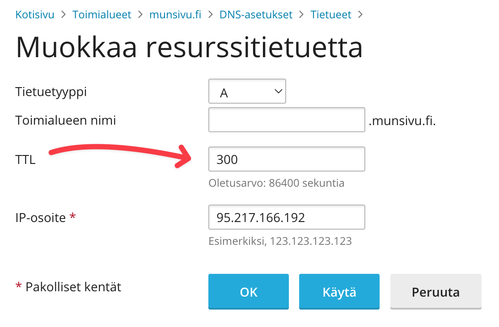
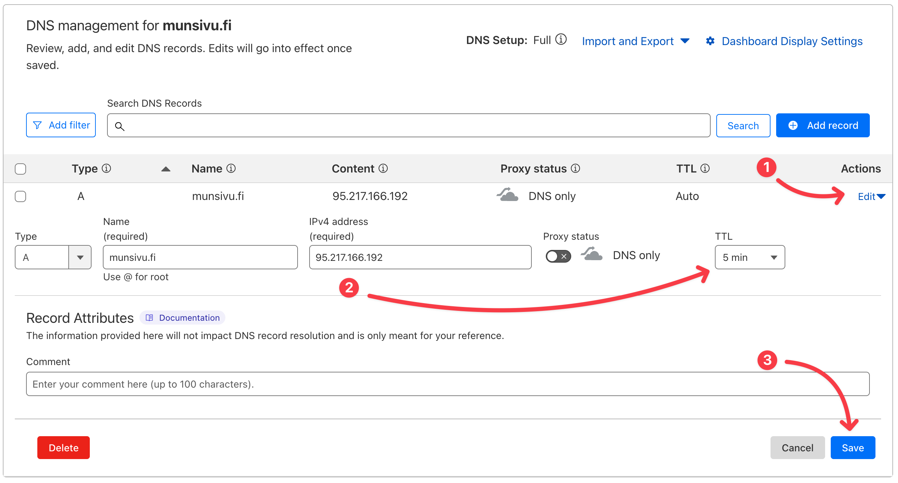

---
authors:
  - korhox
sidebar_label: "Siirto toiselta palveluntarjoajalta"
---
# Webhotellin siirto toiselta palveluntarjoajalta

Webhotellin siirto on hyvä suunnitella huolellisesti ja varautua myös lyhyeen käyttökatkoon sivuston ja sähköpostin toimintaan. Noudattamalla tätä ohjetta voit minimoida siirron aiheuttamat häiriöt.

Voit myös halutessasi ulkoistaa webhotellin siirron Bittivirran asiakaspalveluun. Siirrosta veloitetaan erikseen, ja hinta riippuu siirrettävien palveluiden määrästä. Ota yhteyttä asiakaspalveluumme saadaksesi tarkemman arvion.

**Ohje on tarkoitettu yleiselle tasolle**, emmekä ole voineet huomioida millaiset ohjelmistot ja toimintatavat toisilla palveluntarjoajilla on käytössä. Ohjeen tarkoitus on antaa yleiskuva siirtoprosessista ja asettaa tavoitteet siirrolle. Ohje myös olettaa, että tiedät perusteet webhotellin toiminnasta, kuten FTP:n, tietokantojen ja sähköpostin peruskäytöstä. Emme pysty luomaan ohjetta jokaiselle mahdolliselle ohjelmistolle ja palveluntarjoajalle, joten joudut mahdollisesti etsimään lisäohjeita vanhan palveluntarjoajan ohjelmistoista ja hallintapaneelista.

Ohje on myös suunniteltu yhdelle verkkotunnukselle, mutta siirto jokaiselle verkkotunnukselle erikseen on sama prosessi. Harkitse, tarvitsetko jokaiselle verkkotunnukselle oman webhotellin, vai haluatko jakaa saman webhotellin useamman verkkotunnuksen kesken. Bittivirran webhotellit tukevat useampaa verkkotunnusta (huomioi valitsemasi paketin lisätoimialueiden raja), joten voit halutessasi jakaa saman webhotellin useamman verkkotunnuksen kesken.

Kun jaat saman webhotellin useamman verkkotunnuksen kesken, jakautuu webhotellin levytila, teho ja muut resurssit kaikkien verkkotunnusten kesken. Tämä voi olla edullinen vaihtoehto, jos sinulla on useita pieniä verkkosivustoja tai haluat jakaa kustannuksia useamman verkkotunnuksen kesken. Suuremmille verkkosivustoille tai verkkosivustoille, jotka vaativat enemmän resursseja, kannattaa harkita erillistä webhotellia jokaiselle verkkotunnukselle.

## Siirron valmistelu

Varmista, että sinulla on pääsy sekä vanhan, että Bittivirran uuden webhotellin hallintapaneeleihin. Bittivirran webhotelli toimii Plesk-hallintapaneelissa, joten tarvitset Pleskin kirjautumistiedot.

Tee varmuuskopiot kaikista tärkeistä tiedoista, kuten verkkosivustosta, tietokannoista ja sähköposteista. Tämä onnistuu yleensä vanhan palveluntarjoajan hallintapaneelista heidän tarjoamalla varmuuskopiointityökalulla. Jos edellinen palveluntarjoaja ei tarjoa varmuuskopiointipalvelua, voit ladata sivuston tiedot myös esimerkiksi FTP:n kautta ja tietokannat esimerkiksi phpMyAdminin kautta. Sähköpostit voit varmuuskopioida esimerkiksi IMAP-asiakasohjelmalla, kuten Mozilla Thunderbirdillä.

Suunnittele siirtoaikataulu ja ilmoita vähintään sähköpostikäyttäjille mahdollisista käyttökatkoista. Harkitse myös, tarvitseeko sivuston käyttäjille kertoa siirrosta etukäteen.

Jos sivustollesi on mahdollista kirjautua, eli se on esimerkiksi verkkokauppa, blogi tai keskustelupalsta, kannattaa sivusto sulkea siirron ajaksi, jotta käyttäjät eivät voi tehdä muutoksia sivustoon siirron aikana. Näin varmistat, että käyttäjät eivät menetä siirron aikana tehtyjä muutoksia.

## Siirron vaiheet

<Stepper>
  <Step>
    Aseta vanhan DNS-palvelimen kaikki tietueet mahdollisimman pienelle TTL-arvolle (Time To Live). Tämä nopeuttaa DNS-tietueiden päivittymistä uuden palvelimen IP-osoitteeseen.

    TTL-arvo on yleensä asetettu 1, 6, 12, 36 tai jopa 72 tuntiin, mutta voit asettaa sen esimerkiksi 5 minuuttiin, eli 300 sekuntia. Tämä tarkoittaa, että DNS-tietueet päivittyvät nopeammin, kun siirrät verkkotunnuksen uuteen palvelimeen.

    Kun muutokset on tehty, kannattaa jäädä odottamaan vähintään edellisen TTL-arvon mukainen aika, ennen kuin siirrät verkkotunnuksen uuteen palvelimeen. Näin varmistat, että vanhat tietueet päivittyvät nopeammin, kun myöhemmässä vaiheessa muutamme verkkotunnuksen DNS-tietueet osoittamaan uuteen palvelimeen.

    **Huomaa:** Älä vielä muuta muita tietokenttiä, kuten IP-osoitetta. Muutamme ne myöhemmin, kun siirto on valmis.

    <Tabs>
      <TabItem label="Plesk" value="plesk">
        
      </TabItem>
      <TabItem label="CloudFlare" value="cloudflare">
        
      </TabItem>
    </Tabs>

  </Step>
  <Step>
    Jos et ole jo tehnyt tilausta, tilaa Bittivirran webhotellipaketti aiemman webhotellisi verkkotunnuksen nimellä. Voit tehdä tilauksen [sivustoltamme](https://www.bittivirta.fi/). Tilaa myös halutessasi verkkotunnuksen siirto, joka helpottaa sinua hallitsemaan kaikki sivustosi asiat samasta paikasta, Bittivirran Portaalista.

    Valitse webhotellipaketiksi sellainen, joka sopii tarpeisiisi. Tärkeimpinä valintatekijöinä ovat levytila, sähköpostien määrä ja kuinka tehokkaan paketin haluat. Näet yleensä edelliseltä palveluntarjoajalta, kuinka paljon levytilaa ja sähköpostitilejä olet käyttänyt, joten voit valita sopivan paketin niiden perusteella.

    Verkkotunnuksen siirron hinta riippuu verkkotunnuksen päätteestä, joillakin - kuten esimerkiksi .fi-verkkotunnuksilla siirto on maksuton. Mikäli siirto on maksullinen, verkkotunnus uusitaan samalla myös vuoden ajaksi. Verkkotunnuksen siirto kestää yleensä 0-7 päivää, mutta se voi kestää pidempäänkin riippuen verkkotunnuksen päätteestä.
  </Step>
  <Step>
    **Aloitetaan huoltotyöt**

    Mikäli sivustosi on sellainen, että vierailijat voivat kirjautua sivustolle, kuten verkkokauppa, blogi tai keskustelupalsta, kannattaa sivusto sulkea siirron ajaksi. Näin varmistat, että käyttäjät eivät menetä siirron aikana tehtyjä muutoksia.

    Voit tehdä tämän esimerkiksi asettamalla huoltotilan päälle, jolloin käyttäjät näkevät huoltotilaviestin, mutta eivät voi kirjautua sivustolle. Voit myös asettaa sivuston näkyviin vain hallintapaneelin käyttäjille, jolloin sivusto on edelleen käytettävissä, mutta käyttäjät eivät voi tehdä muutoksia sivustoon.

    Erilaisille sisällönhallintajärjestelmille on omat ohjeensa huoltotilan asettamiseen. Esimerkiksi WordPressissä voit käyttää lisäosaa, joka mahdollistaa huoltotilan asettamisen helposti.
  </Step>
  <Step>
    Valitse verkkotunnus, jonka haluat siirtää, ja avaa sen hallintanäkymä vanhan palveluntarjoajan hallintapaneelissa.
  </Step>
  <Step>
    **Ladataan sivuston tiedostot**

    Avaa vanhan palveluntarjoajan hallintapaneeli ja etsi tiedostojen hallintatyökalu, kuten "File Manager" tai "FTP". Lataa kaikki sivuston tiedostot tietokoneellesi. Tämä voi viedä aikaa riippuen sivuston koosta.

    Joidenkin palveluntarjoajien hallintapaneelissa on mahdollista luoda arkisto (zip-tiedosto) sivuston tiedostoista, jolloin voit ladata kaikki tiedostot kerralla. Jos tämä ei ole mahdollista, etsi FTP/SFTP-asiakasohjelma, kuten FileZilla, ja yhdistä vanhan palveluntarjoajan palvelimeen FTP-tunnuksillasi. Lataa kaikki sivuston tiedostot tietokoneellesi.

    Huomaa, että arkiston luominen vie jonkin verran palvelimen resursseja, kuten esimerkiksi prosessoritehoa ja levytilaa. Jos sivustosi on suuri, tämä voi kestää kauan ja saattaa aiheuttaa palvelimen hidastumista tai jopa kaatumisen. Tällöin suosittelemme käyttämään FTP/SFTP-asiakasohjelmaa.
  </Step>
  <Step>
    **Ladataan tietokanta**

    Jos sivustosi käyttää tietokantaa (MySQL/MariaDB), sinun on ladattava tietokanta. Tämä onnistuu vanhan palveluntarjoajan hallintapaneelista tietokantojen hallintatyökalulla, kuten phpMyAdmin.

    Valitse tietokanta, jonka haluat siirtää, ja vie se SQL-tiedostona. Tallenna tiedosto tietokoneellesi. Jos sinulla on useita tietokantoja, toista tämä vaihe jokaiselle niistä.
  </Step>
  <Step>
    **Ladataan sivuston tiedostot Bittivirran webhotelliin**

    Kirjaudu sisään Bittivirran Plesk-hallintapaneeliin joko asiakasalueen kautta tai suoraan osoitteessa [https://plesk.bittivirta.fi/](https://plesk.bittivirta.fi/). Ohjeet kirjautumiseen löydät [täältä](panel-login).

    Avaa Plesk-hallintapaneeli ja valitse toimialue, johon haluat siirtää sivuston.

    Siirry "Tiedostot" -välilehdelle ja lataa aiemmin lataamasi sivuston tiedostot. Voit käyttää Pleskin tiedostojen hallintatyökalua tai FTP-asiakasohjelmaa, kuten FileZilla, yhdistämällä Pleskin FTP-tunnuksiin.

    Jos käytät Pleskin tiedostojen hallintatyökalua, voit ladata tiedostot vetämällä ja pudottamalla ne Pleskin tiedostojen hallintatyökaluun.

  :::info
  Huomaathan, että jos tiedosto on suurempi kuin 1 GB, on prosessi herkempi katkeamaan, joten suosittelemme käyttämään FTP-asiakasohjelmaa.
  :::
  </Step>
  <Step>
    **Ladataan tietokanta Bittivirran webhotelliin**

    Siirry Pleskin "Tietokannat" -välilehdelle ja luo uusi tietokanta. Anna tietokannalle nimi, käyttäjätunnus ja salasana. Muista tallentaa nämä tiedot, sillä tarvitset niitä myöhemmin.

    Kun tietokanta on luotu, avaa phpMyAdmin Pleskissä ja valitse juuri luotu tietokanta. Tuo aiemmin lataamasi SQL-tiedosto tietokantaan. Tämä voi viedä aikaa riippuen tietokannan koosta.

    Jos sinulla on useita tietokantoja, toista tämä vaihe jokaiselle niistä.
  </Step>
  <Step>
    **Muokataan sivuston asetuksia**

    Jos sivustosi käyttää tiettyjä asetuksia, kuten tietokannan yhteysasetuksia, muokkaa ne vastaamaan Bittivirran webhotellin asetuksia. Tämä voi sisältää tietokannan nimen, käyttäjätunnuksen ja salasanan päivittämisen.

    Jos sivustosi käyttää esimerkiksi WordPressiä, muokkaa `wp-config.php` -tiedostoa ja päivitä tietokannan asetukset vastaamaan Bittivirran webhotellin asetuksia.

    Bittivirran MySQL-tietokantapalvelimen IP-osoite on `10.0.0.4`. Jos otat yhteyden tietokantaan omalta tietokoneeltasi tai muuten webhotellin ulkopuolelta, käytä sen sijaan `mysql-1.bittivirta.fi` -osoitetta.
  </Step>
  <Step>
    **Sähköpostin siirto**

  :::info
  Jos käytät kolmannen osapuolen sähköpostipalvelua, kuten Google Workspacea tai Microsoft 365, voit ohittaa tämän vaiheen. Seuraavassa vaiheessa siirrämme verkkotunnuksen DNS-tietueet osoittamaan uuteen palvelimeen, jolloin sähköposti ohjautuu automaattisesti uuteen palvelimeen.

  Mikäli olet kiinnostunut Bittivirran tarjoamasta Microsoft 365-palveluista, kysy asiakaspalvelustamme lisätietoja. Siirtyessäsi meidän Microsoft 365-palveluiden asiakkaaksi teemme DNS-siirron tarvittaessa puolestasi.
  :::

    Jos sinulla on sähköpostitilejä vanhalla palveluntarjoajalla, on ne helppo siirtää Bittivirran webhotelliin. Voit myös halutessasi aloittaa "puhtaalla pöydältä" ja luoda uudet sähköpostitilit Bittivirran webhotellissa ilman siirtoa.

    Siirto onnistuu seuraavasti:
    - Avaa Bittivirran Plesk-hallintapaneeli ja avaa "Verkkosivustot ja toimialueet" -välilehdeltä sen verkkotunnuksen hallinta klikkaamalla sitä ja avaa "Sähköposti" -välilehti.
    - Klikkaa "Sähköpostin tuonti" -painiketta.
    - Klikkaa "Tuo sähköpostit" -painiketta.
    - Täytä sähköpostitilin asetukset, avaa myös "Näytä lisävalinnat". Vanhat sähköpostin tiedot löydät vanhan palveluntarjoajan hallintapaneelista. Älä käytä IMAP-isäntänä verkkotunnustasi, vaan käytä joko edellisen palveluntarjoajan sähköpostipalvelimen isäntänimeä tai IP-osoitetta. Myöhemmässä vaiheessa suoritamme siirron vielä uudelleen, jolloin vahingossa vanhalle palveluntarjoajalle menneet sähköpostit siirtyvät Bittivirran webhotelliin.
    - Klikkaa OK.

    Toista toimenpiteet jokaiselle sähköpostitilille, jonka haluat siirtää.
  </Step>
  <Step>
    **DNS-tietueiden siirto**

    Tässä kohtaa sinun tarvitsee joko tietää, tai osata arvioida mitkä DNS-tietueet vanhan palveluntarjoajan DNS-palvelimella ovat sinulla käytössä edelleen, vaikka poistut vanhalta palveluntarjoajalta. Tälläisia voivat olla esimerkiksi Microsoft 365, Google Workspace, tai muut palvelut, jotka käyttävät verkkotunnuksesi DNS-tietueita esimerkiksi verkkotunnuksen vahvistamiseen.

    Kopioi tietueet vanhan palveluntarjoajan kautta tai tarkista ne kolmansien osapuolten palveluiden ohjeista. Aseta DNS-tietueet Bittivirran Plesk-hallintapaneelin DNS-hallintaan.

  :::danger
  Älä siirä niitä tietueita, jotka osoittavat vanhan palveluntarjoajan palvelimelle, kuten verkkosivuston ja sähköpostin tietueita, sillä ne lakkaavat toimimasta kun lopetat vanhan palveluntarjoajan palvelun.
  :::
  </Step>
  <Step>
    **Nimipalvelimien muuttaminen**

    Kun olet siirtänyt kaikki tarvittavat tiedot ja asetukset, voit muuttaa verkkotunnuksen nimipalvelimet osoittamaan Bittivirran webhotelliin. Jos verkkotunnuksesi on siirretty Bittivirralle, voit tehdä tämän Bittivirran asiakasalueella verkkotunnuksen hallintanäkymässä, valitse nimipalvelimiksi oletusnimipalvelimet ja tallena.

    Jos verkkotunnuksesi on edelleen vanhalla palveluntarjoajalla, kirjaudu heidän hallintapaneeliinsa ja muuta verkkotunnuksen nimipalvelimet osoittamaan Bittivirran nimipalvelimiin:
    - `ns1.bittivirta.fi`
    - `ns2.bittivirta.fi`
    - `ns3.bittivirta.fi`
    - `ns4.bittivirta.fi`
  </Step>
  <Step>
    Tarkista, että kaikki sivuston tiedostot ja tietokannat on siirretty oikein ja että sivusto toimii odotetusti. Siirto on nyt pääosin valmis ja voit julkaista sivustosi tai poistaa sen huoltotilan pois käytöstä.

    Vanha palveluntarjoaja kannattaa pitää vielä parin päivän - viikon ajan voimassa, sillä DNS-tietueiden päivittyminen voi kestää jonkin aikaa.

    Vielä ennen kun lopetat vanhan palveluntarjoajan palvelun, suorita vielä sähköpostitilien siirto uudelleen, jotta kaikki vanhalle palveluntarjoajalle menneet sähköpostit siirtyvät Bittivirran webhotelliin. Siirto ei poista uusia viestejä, eikä siirrä uudelleen viestejä, jotka ovat jo siirretty. Jos tosin olet poistanut uudelta tililtä viestejä, ne saattavat siirtyä uudelleen vanhalta palveluntarjoajalta.

    Löydät sähköpostitilien aiemmat siirrot siirtotyökalusta ja voit sitä kautta suorittaa siirron uudelleen ilman, että sinun tarvitsee täyttää asetuksia uudelleen.
  </Step>
  <Step>
    Valmista! Olet onnistuneesti siirtänyt webhotellisi Bittivirran palveluun. Muista tarkistaa sivustosi toimivuus ja varmistaa, että kaikki toimii odotetusti.

    Mikäli kohtaat ongelmia siirrossa, voit ottaa yhteyttä Bittivirran asiakaspalveluun. Autamme mielellämme ongelmien ratkaisemisessa ja annamme lisäohjeita tarvittaessa.
  </Step>
</Stepper>

