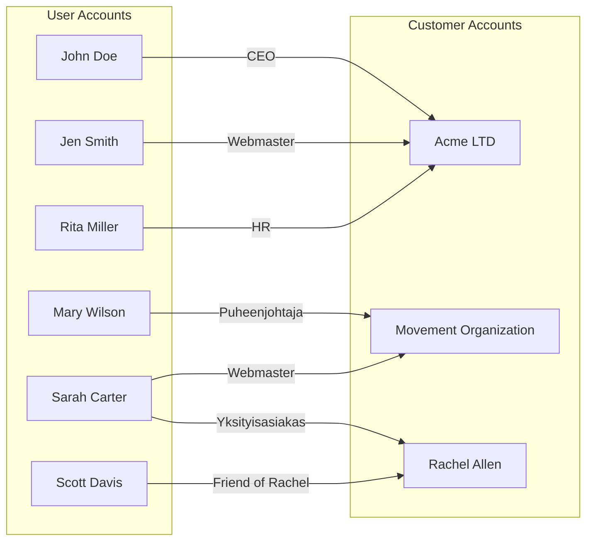

# Customer area

The customer area has separate user and customer accounts. User accounts are personal accounts used to manage customer relationships. This allows you to manage one or more corporate, community, or personal accounts.

In the example, you can see how different user accounts are assigned management and/or viewing rights to different customer accounts.

## User and client account

There are separate user and customer accounts in the customer area. A user account is unique and is created for you. A customer account is your company's own and is created on the basis of your company's Y-identifier or customer name. Your customer account is used to order services and pay bills, for example.

One user account can have more than one customer account. You can change your customer account at any time:

1. Login to your account [portal.bittivirta.fi/login](https://portal.bittivirta.fi/login)
2. Select "Change customer account"
    <Image style={{ maxWidth: 600 }} img={require("./assets/asiakastili.png")}
    />
3. Select the customer account you want to sign in to by clicking on "Change customer account"
    <Image img={require("./assets/asiakastilit.png")} />

